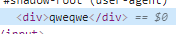

#ТЕХНИЧЕСКОЕ ЗАДАНИЕ AUTOMATION QA ENGINEER

##Тест кейсы:
###Войти с незаполненными логином и паролем (EmptyFieldsSubmitClickedTest) 

| Предусловия        | Ожидаемый результат  | Фактический результат |
|:------------:|:------------:|:------------:|
| Открыть браузер Chrome      | Браузер запущен | |
| Перейти по ссылке http://localhost:8080/auth/realms/Demo/account |Открывается страница авторизации|
| **Шаги**       | **Ожидаемый результат**           | **Фактический результат**  |
| Нажать кнопку `Sign In`       | Получаем сообщение: "*Invalid username or password.*"|   |
| **Постусловия**       | **Ожидаемый результат**           | **Фактический результат**  |
| Закрыть браузер       |Браузер закрыт            |   |

###Войти с корректным логином и паролем (PositiveLoginTest)

| Предусловия        | Ожидаемый результат  | Фактический результат |
|:------------:|:------------:|:------------:|
| Открыть браузер Chrome      | Браузер запущен | |
| Перейти по ссылке http://localhost:8080/auth/realms/Demo/account |Открывается страница авторизации|
| **Шаги**       | **Ожидаемый результат**           | **Фактический результат**  |
| В поле `Username or email` ввести логин пользователя|Отображается логин пользователя в поле|   |
| В поле `Password` ввести пароль пользователя|В поле отображается, что пароль скрыт ****|В DOM пароль видим |
| Нажать кнопку `Sign In`       | Отображается страница редактирования аккаунта|   |
| **Постусловия**| **Ожидаемый результат**|**Фактический результат**|
| Закрыть браузер       |Браузер закрыт            |   |

###Войти с некорректным логином или паролем (NegativeLoginTest)

| Предусловия        | Ожидаемый результат  | Фактический результат |
|:------------:|:------------:|:------------:|
| Открыть браузер Chrome      | Браузер запущен | |
| Перейти по ссылке http://localhost:8080/auth/realms/Demo/account |Открывается страница авторизации|
| **Шаги**       | **Ожидаемый результат**           | **Фактический результат**  |
| В поле `Username or email` ввести логин пользователя|Отображается логин пользователя в поле|   |
| В поле `Password` ввести пароль пользователя|В поле отображается, что пароль скрыт ****|В DOM пароль видим |
| Нажать кнопку `Sign In`       | Получаем сообщение: "*Invalid username or password.*"|   |
| **Постусловия**| **Ожидаемый результат**|**Фактический результат**|
| Закрыть браузер       |Браузер закрыт            |   |

###Зарегистрировать нового пользователя (SignUpTest)

| Предусловия        | Ожидаемый результат  | Фактический результат |
|:------------:|:------------:|:------------:|
| Открыть браузер Chrome      | Браузер запущен | |
| Перейти по ссылке http://localhost:8080/auth/realms/Demo/account |Открывается страница авторизации|
| **Шаги**       | **Ожидаемый результат**           | **Фактический результат**  |
| Перейти по ссылке `Register`|Отображается страница ввода регистрационных данных|   |
| В поле `First name` ввести имя пользователя|Отображается имя пользователя в поле|   |
| В поле `Last name` ввести фамилию пользователя|Отображается фамилия пользователя в поле|   |
| В поле `Email` ввести эл.почту пользователя|Отображается email пользователя в поле|   |
| В поле `Username` ввести логин пользователя|В поле отображается логин пользователя||
| В поле `Password` ввести пароль пользователя|В поле отображается, что пароль скрыт ****|В DOM пароль видим |
| В поле `Confirm password` ввести пароль пользователя|В поле отображается, что пароль скрыт ****|В DOM пароль видим |
| Нажать кнопку `Register` |Отображается страница редактирования аккаунта|   |
| **Постусловия**| **Ожидаемый результат**|**Фактический результат**|
| Закрыть браузер       |Браузер закрыт            |   |

##Архитектура фреймворка:

###src/test/java/tests:
`EmptyFieldsSubmitClickedTest` - Войти с незаполненными логином и паролем

`NegativeLoginTest` - Войти с некорректным логином или паролем

`PositiveLoginTest` - Войти с корректными логином и паролем

`SignUpTest` - Зарегистрировать нового пользователя

`TestBase` - базовый класс для тестов

`TestLifecycleLogger` - интерфейс для обеспечения логирования тестового запуска

###src/test/java/appmanager
`ApplicationManager` - класс отвечающий за инициализацию и закрытие веб драйвера, открытие веб-страницы 

###src/main/java/dto
**Data Transfer Object** классы для обеспечения передачи тестовых данных непосредственно в сам тестовый метод.

`NewUser` - Данные для регистрации нового пользователя

`User` - Данные для входа пользователя в систему

Использую **@MethodSource** и **@ParameterizedTest**. Для входа в систему данные генерируются в @MethodSource методе, в случае регистрации нового пользователя данные зачитываются из файла `users.json`

###src/main/java/pages
Классы для описания непосредственно страниц и методов взаимодействия с их элементами.

`BasePage` - базовый класс для страниц

`LoginPage` - страница входа в систему

`RegisterPage` - страница регистрации нового пользователя

`UserPage` - страница редактирования пользователя

###src/main/resources
Тестовые данные для регистрации пользователей

`users.json`

##Инструкция по запуску
###Установка тестовой среды
1. Скачать и установить Docker https://www.docker.com/
2. Установить с помощью Docker Keycloak https://www.keycloak.org/getting-started/getting-started-docker
   `docker run -p 8080:8080 -e KEYCLOAK_USER=admin -e KEYCLOAK_PASSWORD=admin quay.io/keycloak/keycloak:13.0.0`
3. Зайти в http://localhost:8080/auth/admin
4. Настроить свой realm
5. Добавить пользователя и сохранить
6. Перейти в http://localhost:8080/auth/realms/myrealm/account, чтобы убедиться, что все настроено верно

7. `git clone` - клонирует репозиторий на локальную машину
8. `docker build -t keyclocktask:latest . ` - билдим образ контейнера
9. `docker run -it --network="host" keyclocktask` - запускаем образ
